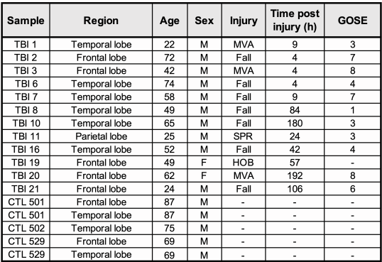

```{=html}
<style>
body {
  font-size: 16px;
}

caption {
  font-size: 14px;
  font-style: italic;
}
</style>
```

```{r setup, include=FALSE, echo=FALSE}
knitr::opts_chunk$set(
                      warning = FALSE, # suppressing warning messages
                      message = FALSE,
                      knitr.kable.max_rows = 5)
```

# Introduction

Traumatic brain injury (TBI) frequently leads to lasting neurological deficits, driven largely by a strong yet unresolved noninflammatory reaction. To better understand this process, I re-analyzed the published `snRNA-seq` dataset `GSE209552` [Garze et al, 2023](https://doi.org/10.1016/j.celrep.2023.113395), to take advantage of their single cell resolution.



# Data Download {#data-download}

-   My choice of dataset is `GSE209552`.
-   Control: non-neuronal death postmortem brain
-   Treatment: Traumatic brain injury (TBI)
-   Note: `GSE209552` is single nucleus RNA-seq (`snRNA-seq`), a variant of `scRNA-seq` that only sequence nucleus `RNA`.
-   Note: The scripts below frequently crashed R due to memory constrain on my laptop (16GB). I anticipate 32GB of RAM is needed to safely run scripts below.

```{r}
# Define global constant
GSE_NUM <- "GSE209552"
```

## GEOmetadb setup

To setup I followed [GEOmetadb Tutorial Chapter 3](https://bcb420-2026.github.io/Exercise_Finding_Expression_data/setting-up-geometadb.html).

```{r}
# Install required package if not installed
if (!requireNamespace("BiocManager", quietly = TRUE))
  install.packages("BiocManager")
if (!requireNamespace("GEOmetadb", quietly = TRUE))
  BiocManager::install("GEOmetadb")
if (!requireNamespace("DBI", quietly = TRUE))
  install.packages("DBI")
if (!requireNamespace("RSQLite", quietly = TRUE))
  install.packages("RSQLite")
if (!requireNamespace("dplyr", quietly = TRUE))
  install.packages("dplyr")
if (!requireNamespace("ggplot2", quietly = TRUE))
  install.packages("ggplot2")

# Attach packages
library(GEOmetadb)
library(DBI)
library(RSQLite)

# Download SQLite database if not exist
if (!file.exists('GEOmetadb.sqlite')) getSQLiteFile()
file.info('GEOmetadb.sqlite')

# Connect to database
con <- dbConnect(SQLite(), 'GEOmetadb.sqlite')
```

## Download whole GSE209552

I followed [Identifier Mapping Tutorial](https://bcb420-2026.github.io/Example_Student/id_mapping/getting-data-from-geo.html). The helper function defined below is modified based on [Identifier Mapping Tutorial's helper function](https://github.com/bcb420-2026/Example_Student/blob/main/in_class_exercises/id_mapping/fetch_geo_supp.R) to avoid duplicated download.

```{r}
# Define helper function
fetch_geo_supp <- function(gse, destdir = "data") {
  # Calculate the actual path where GEOquery puts the files
  target_path <- file.path(destdir, gse)
  
  # Check if directory exists AND contains files
  if (dir.exists(target_path) && length(list.files(target_path)) > 0) {
    message(paste("Data found at", target_path, "- Skipping download."))
    return(invisible(target_path))
  }
  
  # If missing or empty, proceed with download
  message(paste("Downloading", gse, "to", destdir, "..."))
  dir.create(destdir, showWarnings = FALSE, recursive = TRUE)
  GEOquery::getGEOSuppFiles(GEO = gse, baseDir = destdir, makeDirectory = TRUE)
  
  invisible(target_path)
}

# Download
fetch_geo_supp(gse = GSE_NUM)
```

## Construct snRNA-seq only reference list

This GSE contain both `snRNA-seq` and `bulk RNA-seq` sample. Removal of bulk RNA-seq is needed to avoid significant batch effect due to their technical difference. Although the number of samples is reduced to 17, it's still sufficient amount.

Refer to the original paper's method section ([Garza et al, 2023](https://doi.org/10.1016/j.celrep.2023.113395)), only the `snRNA-seq` was done by `Illumina NextSeq6000` platform, [GPL24676](https://www-ncbi-nlm-nih-gov.myaccess.library.utoronto.ca/geo/query/acc.cgi?acc=GPL24676). I can use this clue to exclude all `bulk RNA-seq`.

Since all GSMs of this study are packed in one `GSE209552_RAW.tar` file in GEO, I can't indicate which platform to include/exclude at download step. Thus I constructed a list of `GPL24676` GSMs for downstream reference by query `GEOmetabd`.

```{r}
# Define desired platform
snRNA_platform <- "GPL24676"

# Construct the query
# We join the 'link' table (gse_gsm) with the 'sample' table (gsm) 
# to check the platform (gpl) column.
sql_filter <- paste0(
  "SELECT t1.gsm ",
  "FROM gse_gsm t1 ",
  "JOIN gsm t2 ON t1.gsm = t2.gsm ",
  "WHERE t1.gse = '", GSE_NUM, "' ",
  "AND t2.gpl = '", snRNA_platform, "'"
)

# Get the list of pure snRNA-seq samples
sn_gsm_list <- dbGetQuery(con, sql_filter)$gsm

# View results
print(paste("Found", length(sn_gsm_list), "snRNA-seq samples."))
sn_gsm_list
```

# Access data quality

-   The following analysis is build on [Seurat](https://satijalab.org/seurat/) framework ([Hao et al, 2023](https://doi.org/10.1038/s41587-023-01767-y)) and referring [Heumos et al, 2023](https://doi.org/10.1038/s41576-023-00586-w) for high-level idea.

```{r}
# Install Seurat if not
if (!requireNamespace("Seurat", quietly = TRUE))
  install.packages("Seurat")
```

## Reorganize snRNA-seq files

The raw count data was stored in `GSE209552_RAW.tar` file, thus need to be unpacked using `untar()` function.

```{r}
# Attach packages
library(Seurat)
library(data.table)
library(Matrix)
library(dplyr)
library(stringr)

# Define data paths
tar_file <- "data/GSE209552/GSE209552_RAW.tar"
extract_dir <- "data/GSE209552/raw_files"

# Define unpack helper function
unpack_geo_tar <- function(tar_path, dest_dir) {
  if (dir.exists(dest_dir) && length(list.files(dest_dir)) > 0) {
    message(paste("📂 Extracted files found at", dest_dir, "- Skipping unpack."))
    return(invisible(dest_dir))
  }
  if (!file.exists(tar_path)) {
    stop(paste("❌ Tar file not found:", tar_path))
  }
  message(paste("📦 Unpacking", basename(tar_path), "..."))
  dir.create(dest_dir, showWarnings = FALSE, recursive = TRUE)
  untar(tar_path, exdir = dest_dir)
  message("✅ Unpacking complete.")
  return(invisible(dest_dir))
}

# Run the unpacker
unpack_geo_tar(tar_file, extract_dir)
```

The unpacked file is very messy, contain all 10x genomics `snRNA-seq` files, `bulk RNA-seq` files, subsetted Transposable Elements file, clustered files, and normalized files. Among those, only 10x genomics `snRNA-seq` is what I need.

To extract, I utilize previously defined `sn_gsm_list`, loop over it, exclude any file contain `_TE_`, indicate Transposable Elements, only extract files end with either `barcode`, `matrix`, or `features`. Lastly, trim the file name to `barcode`, `matrix`, `features` only, to meet the expected naming format of [Seurat](https://satijalab.org/seurat/)'s `Read10X()` function.

```{r}
# Reorganize all snRNA-seq 10x files in to a new directory
dest_dir <- "data/GSE209552/10x_organized"    # Where they should go
dir.create(dest_dir, recursive = TRUE, showWarnings = FALSE)

# --- MAIN LOOP ---
message(paste("🚀 Organizing files for", length(sn_gsm_list), "samples..."))

skipped_count <- 0
moved_count   <- 0

for (gsm in sn_gsm_list) {
  
  # 1. Define the specific destination path for this sample
  sample_subdir <- file.path(dest_dir, gsm)
  
  # 2. CHECK: Does it already exist?
  if (dir.exists(sample_subdir) && length(list.files(sample_subdir)) >= 3) {
    skipped_count <- skipped_count + 1
    next
  }
  
  # 3. Create directory
  dir.create(sample_subdir, showWarnings = FALSE)
  
  # 4. Find source files (Exclude the 'TE' files)
  pattern <- paste0("^", gsm)
  files_to_move <- list.files(extract_dir, pattern = pattern, full.names = TRUE)
  files_to_move <- files_to_move[!grepl("_TE_", files_to_move)]
  
  # Safety Checks
  if (length(files_to_move) == 0) {
    warning(paste("⚠️ Skipping", gsm, "- No source files found."))
    next
  }
  
  # 5. MOVE & RENAME
  # We identify specific files to ensure we rename them correctly for Seurat
  f_matrix   <- files_to_move[grep("matrix", files_to_move, ignore.case = TRUE)]
  f_barcodes <- files_to_move[grep("barcodes", files_to_move, ignore.case = TRUE)]
  f_features <- files_to_move[grep("features|genes", files_to_move, ignore.case = TRUE)]
  
  # Verify we found exactly 1 of each before moving
  if (length(f_matrix) == 1 && length(f_barcodes) == 1 && length(f_features) == 1) {
    
    # Rename Matrix -> matrix.mtx.gz
    file.rename(f_matrix, file.path(sample_subdir, "matrix.mtx.gz"))
    
    # Rename Barcodes -> barcodes.tsv.gz
    file.rename(f_barcodes, file.path(sample_subdir, "barcodes.tsv.gz"))
    
    # Rename Genes/Features -> features.tsv.gz
    file.rename(f_features, file.path(sample_subdir, "features.tsv.gz"))
    
    message(paste("  ✅ Standardized & Moved:", gsm))
    moved_count <- moved_count + 1
    
  } else {
    warning(paste("  ⚠️ Skipping", gsm, "- Could not find unique 10x triplet to standardize."))
  }
}

# --- SUMMARY ---
message("🎉 Organization Complete.")
message(paste("  🔹 Samples moved & standardized:", moved_count))
message(paste("  🔸 Samples skipped (already done):", skipped_count))
```

## Load snRNA-seq files into R using Seurat

Loading of expression data is done by iteratively call [Seurat](https://satijalab.org/seurat/)'s `Read10X()` and `CreateSeuratObject()` function over all GSMs. They cooperatively first read a 10X genomics structured file and create a `Seurat Object`, which is the basic unit for any data manipulation in [Seurat](https://satijalab.org/seurat/).

```{r}
# Get the list of sample subdirectories
sample_dirs <- list.dirs(dest_dir, recursive = FALSE)

# Define a list storing seurat obj of all GSMs
seurat_list <- list()

message(paste("🚀 Loading", length(sample_dirs), "samples..."))
for (dir in sample_dirs) {
  # Extract GSM ID from the folder name (e.g., "GSM6385438")
  gsm_id <- basename(dir)
  
  # A. Read 10x Data
  # Because you renamed the files, Read10X finds them automatically!
  counts <- Read10X(data.dir = dir)
  
  # B. Create Seurat Object
  seurat_list[[gsm_id]] <- CreateSeuratObject(
    counts = counts, 
    project = gsm_id, 
    min.cells = 0, 
    min.features = 0
  )
  
  message(paste("  ✅ Loaded:", gsm_id))
}
length(seurat_list)
```

However, the metadata (contain condition information) need to fetched from [GEOmetadb](https://www.bioconductor.org/packages/release/bioc/html/GEOmetadb.html), and extract from `GSM` table's `characteristics_ch1` column, and then insert into corresponding Seurat object's `meta.data` layer.

```{r}
# Load GSMs metadata from GEOmetadb
gsm_list_string <- paste(paste0("'", sn_gsm_list, "'"), collapse = ",")
sql <- paste0(
  "SELECT gsm, title, characteristics_ch1 ",
  "FROM gsm ",
  "WHERE gsm IN (", gsm_list_string, ")"
)
metadata <- dbGetQuery(con, sql)

# Merge the condition metadata to corresponding Seurat obj's metadata
metadata$Condition <- sub(".*condition:\\s*([^;]+).*", "\\1", metadata$characteristics_ch1, ignore.case = TRUE)

# Loop and assign
for (gsm in names(seurat_list)) {
  # Find the condition for this GSM
  val <- metadata$Condition[metadata$gsm == gsm]
  
  # Assign to Seurat object (handling missing values)
  if (length(val) > 0) {
    seurat_list[[gsm]]$Condition <- val
  } else {
    seurat_list[[gsm]]$Condition <- "Unknown"
  }
}

# Final Merge all samples into one seurat obj
combined_seurat <- merge(
 x = seurat_list[[1]], 
 y = seurat_list[-1], 
 add.cell.ids = names(seurat_list), 
 project = "GSE209552"
)
# Verify
table(combined_seurat$Condition)
```

## Free memory

```{r}
# Disconnect SQLite connection
dbDisconnect(con)

# Delete memory pointer from R
rm(con)
rm(seurat_list)
rm(counts)
rm(metadata)

# # De allocate unused memory
gc()
```

## Data exploriation {#data-exploriation}

Plot the following statistics:

-   Number of unique identifier (infer coverage)
-   Number of total amount of identifier (infer depth)
-   Number of samples
-   Number of cells

```{r qc-plot-per-condition, fig.width=14, fig.height=14, fig.align='center', dpi=300, out.width="100%"}
library(ggplot2)
library(patchwork)

theme_set(theme_classic(base_size = 26))

# 1. Coverage (nFeature_RNA)
p_cov <- VlnPlot(
  combined_seurat, 
  features = "nFeature_RNA", 
  group.by = "Condition", 
  pt.size = 0
) + 
  ggtitle("Coverage") + 
  ylab("nFeature_RNA")

# 2. Depth (nCount_RNA) with adjusted axis
p_depth <- VlnPlot(
  combined_seurat, 
  features = "nCount_RNA", 
  group.by = "Condition", 
  pt.size = 0
) + 
  ggtitle("Depth") + 
  ylab("nCount_RNA") +
  scale_y_continuous(limits = c(0, 50000)) 

# Combine them to recreate p_metrics
p_metrics <- p_cov | p_depth

# Number of cells among conditions
meta_data <- combined_seurat@meta.data

# A. Bar plot: Total Number of Cells per Condition
p_cells <- ggplot(meta_data, aes(x = Condition, fill = Condition)) +
  geom_bar(color = "black") +
  geom_text(stat = 'count', aes(label = after_stat(count)), vjust = -0.5) +
  theme_classic() +
  labs(title = "Total Cells per Group", y = "Number of Cells", x = NULL) +
  theme(legend.position = "none")

# Number of samples among conditions
p_samples <- meta_data %>%
  group_by(Condition) %>%
  summarize(Sample_Count = n_distinct(orig.ident)) %>%
  ggplot(aes(x = Condition, y = Sample_Count, fill = Condition)) +
  geom_bar(stat = "identity", color = "black") +
  geom_text(aes(label = Sample_Count), vjust = -0.5) +
  theme_classic() +
  labs(title = "Total Samples (GSMs) per Group", y = "Number of Samples (GSMs)", x = NULL) +
  theme(legend.position = "none")

# Merge plots
final_plot <- p_metrics / (p_samples | p_cells)

# Adjust font size
final_plot <- final_plot & theme_classic(base_size = 16)
final_plot
```

**Figure 2:** Overall statistics of dataset `GSE209552` grouped by condition (Control v.s. tbi). The upper-left panel indicate the number of unique identifier; The upper-right panel indicate the total amount of identifier, the maximum amount of identifier was limited up to 50000 for the sake of aesthetics; The lower-left panel indicate number of samples (GSMs); The lower-right panel indicate the number of cells"; X-axis of all four panel indicate condition.

Generally, control group have higher depth and coverage, but less sample and cells.

Then plot the statistics below per sample (GSM):

-   Number of unique identifier (infer coverage)
-   Number of total amount of identifier (infer depth)
-   Number of cells

```{r qc-plot-per-sample, fig.width=14, fig.height=14, fig.align='center', dpi=300, out.width="100%"}

# Define the vertical line style once to keep it consistent
vertical_line <- geom_vline(xintercept = 5.5, linetype = "dashed", color = "red", size = 1)

# 1. Coverage (nFeature_RNA)
p_cov <- VlnPlot(
  combined_seurat, 
  features = "nFeature_RNA", 
  group.by = "orig.ident", 
  pt.size = 0
) + 
  ggtitle("Coverage") + 
  ylab("nFeature_RNA") +
  theme(
    axis.text.x = element_text(angle = 45, hjust = 1),
    legend.position = "none",
    axis.title.x = element_blank() # Often cleaner to remove x-label if text is rotated
  ) + vertical_line

# 2. Depth (nCount_RNA) with adjusted axis
p_depth <- VlnPlot(
  combined_seurat, 
  features = "nCount_RNA", 
  group.by = "orig.ident", 
  pt.size = 0
) + 
  ggtitle("Depth") + 
  ylab("nCount_RNA") +
  scale_y_continuous(limits = c(0, 50000)) +
  theme(
    axis.text.x = element_text(angle = 45, hjust = 1),
    legend.position = "none",
    axis.title.x = element_blank()
  ) + vertical_line

# A. Bar plot: Total Number of Cells per Sample
meta_data <- combined_seurat@meta.data # Ensure meta_data is defined
p_cells <- ggplot(meta_data, aes(x = orig.ident, fill = orig.ident)) +
  geom_bar(color = "black") +
  geom_text(stat = 'count', aes(label = after_stat(count)), vjust = -0.5) +
  theme_classic() +
  labs(title = "Total Cells per Sample", y = "Number of Cells", x = NULL) +
  theme(
    axis.text.x = element_text(angle = 45, hjust = 1),
    legend.position = "none"
  ) +
  coord_fixed(ratio = 0.0005)  +
  scale_y_continuous(limits = c(0, 6000)) + vertical_line

# Merge plots
final_plot <- p_cov / p_depth / p_cells + 
  plot_layout(heights = c(1, 1, 1))

# Adjust font size (and re-apply theme elements if needed by the base theme)
final_plot <- final_plot & theme_classic(base_size = 16) & 
  theme(
    axis.text.x = element_text(angle = 45, hjust = 1),
    legend.position = "none"
  )

final_plot
```

**Figure 3:** Overall statistics per sample (GSM). The top panel indicate number of unique identifier; The middle panel indicate number of total identifier; The bottom panel indicate number of cells; X-axis of all three panel indicate samples (GSMs); The vertical red dash line separate control (left side of red line), and tbi (right side of red line).

In general, the sequence depth and coverage is more consistence among control group. Tbi group has more variated depth and coverage with `GSM637681` being the sample of lowest depths and coverage. The number of cells within different sample also varies, from highest 3708 (`GSM6376822`) to lowest 358 (`GSM6376820`). This imbalance in cell number may result in downstream analysis dominate by sample which contain more cells.

Another common quality control step in `scRNA-seq` is to remove `damaged cells`. When damaged cells were sequenced or damaged during sequencing, the expression intensity will scaled down due to leaked RNA, thus significantly bias downstream clustering, annotation, and differential gene expression analysis. A common method to conduct this filtering is using `mitochondrial transcript percentage`, based on this idea that if a cell has leaked RNA, the `mitochondrial transcript percentage` will be relatively higher since mitochondria is relatively large and less likely to leak. Empirically, the threshold is set to be `5% ~ 10%`

However, when it comes to `snRNA-seq`, `mitochondrial transcript percentage` is expected to be `0%` because of the exclusion of cytoplasm, and any none-zero `mitochondrial transcript percentage` indicate incomplete exclusion of cytoplasm [Amezquita et al, 2020](https://doi.org/10.1038/s41592-019-0654-x). Thus I may want to choice a more strict threshold for `snRNA-seq`, like `1% ~ 2%`, to match the wet-lab design while tolerate low-quality cell to certain extent.

```{r mt-plot, fig.width=14, fig.height=14, fig.align='center', dpi=300, out.width="100%"}
# Use seurat PercentageFeatureSet() function
# Create a new entry in meta.data layer storing mitochondrial transcript percentage
combined_seurat[["percent.mt"]] <- PercentageFeatureSet(combined_seurat, pattern = "^MT-")

# Defin a horizontal line at Y == 5 indicate empirical mito% threashold
horizontal_line <- geom_hline(yintercept = 10, linetype = "dashed", color = "red", size = 1)

# Percent MT per CONDITION (Control vs TBI)
p_condition <- VlnPlot(combined_seurat, features = c("percent.mt"), group.by = "Condition", pt.size = 0) +
  theme(
    axis.title.x = element_blank(), 
    legend.position = "none" # Hide legend since x-axis already shows the names
  ) + 
  ggtitle("Mitochondrial % by Condition") + 
  horizontal_line + 
  ylab("Mitochondrial Transcript (%)") + 
  annotate("text", x = 0.5, y = 12, label = "mito % = 10", color = "black", hjust = 0, size = 5)

# Percent MT per GSM
p_sample <- VlnPlot(combined_seurat, features = c("percent.mt"), group.by = "orig.ident", pt.size = 0) +
  theme(
    axis.title.x = element_blank(), 
    # Rotate x-axis labels 45 degrees so they don't overlap
    axis.text.x = element_text(angle = 45, hjust = 1),
    legend.position = "none" # Hide legend since x-axis already shows the names
  ) + vertical_line + 
  ggtitle("Mitochondrial % by Sample") + 
  horizontal_line + 
  ylab("Mitochondrial Transcript (%)") + 
  annotate("text", x = 0.5, y = 12, label = "mito % = 10", color = "black", hjust = 0, size = 5)

# 4. Combine them
final_mt_plot <- p_condition / p_sample
final_mt_plot
```

**Figure 4:** Mitochondrial transcript percentage grouped by GSMs. The Y-axis indicate mitochondrial transcript percentage; The X-axis of top panel indicate condition (Control v.s.); The X axis of bottom panel indicate GSM samples; The horizontal red dash line indicate empirical Mitochondrial transcript percentage threshold = 10%; The vertical red dash line at bottom panel separate control (left side of red line), and treatment (right side of red line).

However, the `Mitochondrial transcript percentage` is way higher than expected in all samples and the original paper didn't assess the `Mitochondrial transcript percentage` at all ([Garza et al, 2023](https://doi.org/10.1016/j.celrep.2023.113395)). One clue that may explain this unexpected high `Mitochondrial transcript percentage` from their `Limitations of the study` is control tissues were post-mortem sample and tbi tissues were surgically evacuated rare case post-impact. Thus the integrity of samples were not at ideal condition and expected to contain damaged cells.

On the other hands, `mitochondrial transcript percentage` aligned with previous depth and coverage among samples, where control group tend to be more consistent. A hypothesis is that Traumatic Brain Injury (TBI) is a broad term that include various brain damage result from external force, and the intensity and exact pathology may vary among different tbi sample, reflected by sequence depth and coverage. Noticeably, `GSM6376814` has relatively higher mitochondrial transcript percentage, and recall that it's also the sample having lowest depth and coverage, which might imply existing technical variance and/or batch effect that could bias downstream analysis.

## Mapping to HUGO symbols {#mapping-to-hugo-symbols}

Check the current identifier

```{r}
head(rownames(combined_seurat))

length(rownames(combined_seurat)) == length(unique(rownames(combined_seurat)))
```

At a glance, it's `HUGO` symbol. To verify, I can query those symbol against `org.Hs.eg.db`. And `TRUE` indicate the number of gene symbol is equal to the number of unique gene symbol, thus no duplicate.

```{r}
# Install org.Hs.eg.db
if (!requireNamespace("org.Hs.eg.db", quietly = TRUE)) {
  BiocManager::install("org.Hs.eg.db")
}

# Attach org.Hs.eg.db to current session
library(org.Hs.eg.db)

# Check how many of them exist in the official symbol database
valid_symbols <- mapIds(org.Hs.eg.db, 
                        keys = rownames(combined_seurat), 
                        column = "SYMBOL", 
                        keytype = "SYMBOL", 
                        multiVals = "first")

# Calculate the percentage of matches
sum(!is.na(valid_symbols)) / length(rownames(combined_seurat)) * 100
```

`100%` valid symbols confirmed the symbol is actually `HUGO` symbol.

## Cleaning

First I remove `GSM6376814`, since it has the lowest depth, coverage, and highest `mitochondrial transcript percentage`, thus tend to contaminate downstream analysis.

```{r}
combined_seurat <- subset(combined_seurat, subset = orig.ident != "GSM6376814")
```

Based on [Seurat](https://satijalab.org/seurat/) and [Heumos et al, 2023](https://doi.org/10.1038/s41576-023-00586-w), they simply applied hard threshold on mitochondrial transcript percentage, `5%` and `8%`, at their quality control step. Additionally, refer to previous `Figure 3`, I empirically choice the threshold to be `10%`.

```{r}
combined_seurat <- subset(combined_seurat, subset = percent.mt <= 10)
```

In the end, `2887/24621 = 11.7%` cells were removed. Compare with original paper, they removed `9511/24621 = 38.6%` cells ([Garza et al, 2023](https://doi.org/10.1016/j.celrep.2023.113395)). I suppose part of the reason they apply such restrict quality control is they are aware of the low integrity of samples.

```{r filtered-plot, fig.width=14, fig.height=10, fig.align='center', dpi=300, out.width="100%"}
# 1. Mito % Plot (After Cleaning)
p_mito_clean <- VlnPlot(
  combined_seurat, 
  features = "percent.mt", 
  group.by = "orig.ident", 
  pt.size = 0
) + 
  vertical_line + 
  ggtitle("Mitochondrial % per Sample (After Cleaning)") + 
  ylab("Mitochondrial Transcript (%)") + 
  scale_y_continuous(limits = c(0, 10)) + # Zoom in since max is now <= 10
  theme(
    axis.text.x = element_text(angle = 45, hjust = 1), 
    legend.position = "none",
    axis.title.x = element_blank()
  ) +
  coord_fixed(ratio = 0.5)

# 2. Total Cells Plot (Your existing code)
meta_data <- combined_seurat@meta.data 
p_cells <- ggplot(meta_data, aes(x = orig.ident, fill = orig.ident)) +
  geom_bar(color = "black") +
  geom_text(stat = 'count', aes(label = after_stat(count)), vjust = -0.5) +
  theme_classic() +
  labs(title = "Total Cells per Sample (After Cleaning)", y = "Number of Cells", x = NULL) +
  theme(
    axis.text.x = element_text(angle = 45, hjust = 1),
    legend.position = "none"
  ) +
  coord_fixed(ratio = 0.001) +
  scale_y_continuous(limits = c(0, 4000)) + 
  vertical_line

# 3. Combine them vertically
final_clean_plot <- p_mito_clean / p_cells
final_clean_plot
```

**Figure 5:** Number of cells after cleaning grouped by GSMs. The Y-axis indicate number of cells; The X-axis indicate GSMs; The vertical red dash line separate control (left side of red line), and tbi (right side of red line).

# Normalization

Differ from RNA-seq and bulk RNA-seq normalization covered in class, `sc/snRNA-seq` data is `zero-inflated`, most of gene's counts is `0` in most of cells. Thus two of the method covered in class, `TMM` and `RLE`, are not suitable for `sc/snRNA-seq` because they both assume most of the gene are not differentially expressed, `zero-inflated` counts data will yield inflated fold change when ever an algorithm is trying to calculate fold change ([Lytal et al, 2020](https://doi.org/10.3389/fgene.2020.00041)).

## Library size based Log-Normalization & filter low expressed gene

The simple normalization by library size still work as intended and won't affect by inflated zeros and widely utilized in sing-cell transcriptome field as a baseline ([Ge et al, 2025](https://doi.org/10.1371/journal.pone.0335102), [Lytal et al, 2020](https://doi.org/10.3389/fgene.2020.00041), [Amezquita et al, 2019](https://doi.org/10.1038/s41592-019-0654-x)). In `Seurat`, it's wrapped as [NormalizeData()](https://satijalab.org/seurat/reference/normalizedata) function. Note the default `scale.factor` is set to be `10000` to account for `sc/snRNA-seq`'s relative small reads per cell compare with `bulk RNA-seq`.

For visualization, I choice first randomly sample one cell from each `GSM` and plot the pre and post normalized counts on Y-axis, sampled cell on X-axis. The reason of not plot normalized counts per `GSM` is because in `sc/snRNA-seq`, the counts is normalized by the total reads of a cell rather than `GSM`, thus plot normalized counts per `GSM` won't be so meaningful.

In both [Seurat tutorial](https://satijalab.org/seurat/articles/pbmc3k_tutorial), and [Heumos et al, 2023](https://doi.org/10.1038/s41576-023-00586-w), they used the minimum number of cell expressing certain gene to remove low expressed gene instead of thresholding expression level like in `edgeR`. Thus I will also filter low expressed gene based on minimum number of cell.

```{r pre-post-norm-plot, fig.width=14, fig.height=10, fig.align='center', dpi=300, out.width="100%"}
library(tidyr)
library(tibble)

# Collapse the split sample layers into a single unified 'counts' layer
combined_seurat <- JoinLayers(combined_seurat)

# Create a copy of un-normalized data for test purpose
seurat_copy <- combined_seurat

# Randomly sample exactly ONE cell per GSM (orig.ident)
set.seed(42) 
sampled_cells <- combined_seurat@meta.data %>%
  rownames_to_column("Cell_ID") %>%
  group_by(orig.ident) %>%
  sample_n(1) %>%
  pull(Cell_ID)

# Create a mini-Seurat object of just these cells for faster extraction
sc_unfiltered <- subset(combined_seurat, cells = sampled_cells)

# ==========================================
# PLOT 1: Pre-Normalization (Raw Counts)
# ==========================================
raw_matrix <- as.matrix(GetAssayData(sc_unfiltered, layer = "counts"))

df_raw <- as.data.frame(raw_matrix) %>%
  pivot_longer(cols = everything(), names_to = "Cell_ID", values_to = "Count") %>%
  mutate(Sample = sc_unfiltered@meta.data[Cell_ID, "orig.ident"])

p_pre_norm <- ggplot(df_raw, aes(x = Sample, y = Count, fill = Sample)) +
  geom_violin(scale = "width", color = "black", alpha = 0.8) + 
  ggtitle("1. Pre-Normalization: Raw Counts (Unfiltered)") + 
  ylab("Expression (Linear)") +
  theme_classic() +
  theme(axis.text.x = element_blank(), legend.position = "none", axis.title.x = element_blank()) + 
  vertical_line + 
  coord_cartesian(ylim = c(0, 200))


# ==========================================
# PLOT 2: Post-Normalization (Before Filtering)
# ==========================================
# Normalize the main dataset first
combined_seurat <- NormalizeData(combined_seurat, normalization.method = "LogNormalize", scale.factor = 10000)

# Update mini-Seurat object to get the new normalized 'data' layer
sc_unfiltered <- subset(combined_seurat, cells = sampled_cells)

norm_matrix_unfilt <- as.matrix(GetAssayData(sc_unfiltered, layer = "data"))

df_norm_unfilt <- as.data.frame(norm_matrix_unfilt) %>%
  pivot_longer(cols = everything(), names_to = "Cell_ID", values_to = "Normalized_Count") %>%
  mutate(Sample = sc_unfiltered@meta.data[Cell_ID, "orig.ident"])

p_post_unfilt <- ggplot(df_norm_unfilt, aes(x = Sample, y = Normalized_Count, fill = Sample)) +
  geom_violin(scale = "width", color = "black", alpha = 0.8) + 
  ggtitle("2. Post-Normalization: Log-Normalized (Unfiltered)") + 
  ylab("Expression (Log1p)") + 
  theme_classic() +
  theme(axis.text.x = element_blank(), legend.position = "none", axis.title.x = element_blank()) + 
  vertical_line + 
  coord_cartesian(ylim = c(0, 6))


# ==========================================
# PLOT 3: Post-Normalization (After Filtering)
# ==========================================
# Calculate frequencies and filter the main dataset
raw_counts_all <- GetAssayData(combined_seurat, layer = "counts")
cells_per_gene <- rowSums(raw_counts_all > 0)
min_cells <- 10
genes_to_keep <- names(which(cells_per_gene >= min_cells))

message("Number of genes BEFORE filtering: ", nrow(raw_counts_all))
message("Number of genes AFTER filtering (>= ", min_cells, " cells): ", length(genes_to_keep))
message("Total genes removed: ", nrow(raw_counts_all) - length(genes_to_keep))

# Subset the main object to remove noisy, low-expressed genes
combined_seurat_filtered <- subset(combined_seurat, features = genes_to_keep)

# Create a new mini-Seurat object based on the FILTERED dataset
sc_filtered <- subset(combined_seurat_filtered, cells = sampled_cells)

norm_matrix_filt <- as.matrix(GetAssayData(sc_filtered, layer = "data"))

df_norm_filt <- as.data.frame(norm_matrix_filt) %>%
  pivot_longer(cols = everything(), names_to = "Cell_ID", values_to = "Normalized_Count") %>%
  filter(Normalized_Count > 0) %>%
  mutate(Sample = sc_filtered@meta.data[Cell_ID, "orig.ident"])

p_post_filt <- ggplot(df_norm_filt, aes(x = Sample, y = Normalized_Count, fill = Sample)) +
  geom_violin(scale = "width", color = "black", alpha = 0.8) + 
  ggtitle(paste0("3. Post-Normalization: Log-Normalized (Filtered >= ", min_cells, " cells)")) + 
  ylab("Expression (Log1p)") + 
  theme_classic() +
  theme(axis.text.x = element_text(angle = 45, hjust = 1), legend.position = "none", axis.title.x = element_blank()) + 
  vertical_line + 
  coord_cartesian(ylim = c(0, 6))

# ==========================================
# COMBINE PLOTS
# ==========================================
# Stack them vertically 
final_norm_plot <- p_pre_norm / p_post_unfilt / p_post_filt
final_norm_plot
```

**Figure 6:** Pre and post normalized counts per cell ( randomly sample 1 cell per `GSM`). The upper panel indicate the raw counts distribution of the randomly sampled cell; The middle panel indicate the normalized counts of the randomly sampled cell; The bottom panel indicate the distribution of normalized counts after exclude all genes that expressed in less than 10 cells; X-axis indicate the `GSMs` that cell is sampled from; The vertical red dash line separate control (left side of red line), and tbi (right side of red line).

Before filtering, the raw and normalized count are both inflated at zero due to the sparse nature of `sc/snRNA-seq`. After filtering, normalized counts yield interesting vases shape, a flat and wide base with numbers of `beads` attached upon. The flat base is likely because of the `zero-inflated` nature of `sc/snRNA-seq`, even though I exclude all gene that expressed in less than 10 cells, most gene still have counts close to zero, following negative binomial distribution. However, I don't have a well constructed hypothesis to explain those `beads` attached, maybe because the raw input (raw counts) in discrete, the log-Normalized counts will also be discrete. The relative height of the base is reflecting sequence depth of those cell. When those counts close to zero were normalized by total read of a cell, the larger the total read, the smaller the normalized count. Thus the higher the base, the lower the sequence depth.

**Note :** X-axis is the `GSM` those cells sampled from, not `GSM` itself. So we can't infer sequence depth of `GSM` from **Figure 5**.

## Log-CP10k

Since I set the `scale.factor` as `10000`, it's not per million but per 10k. To calculat the overall statistics of Log-normalized data, first extract expression data using `seurat::GetAssayData()` then calculate using `summary()`.

**Note:** apply `as.matrix()` to extracted expression matrix will convert sparse matrix to dense matrix, which required additional `~4.1GB` RAM. Using `@x` operator will exclude all zero value, but memory efficient

```{r}
# 1. Extract the normalized sparse matrix
norm_matrix <- GetAssayData(combined_seurat_filtered, layer = "data")

# This summarizes ONLY the non-zero values hidden inside the sparse matrix structure
summary(norm_matrix@x)
```

The right-skewed property is reflected by small difference between `Min`, `Median`, and `Mean`.

## Free memory

```{r}
# Delete memory pointer from R
rm(combined_seurat)
rm(df_norm_filt)
rm(df_norm_unfilt)
rm(df_raw)
rm(norm_matrix_filt)
rm(norm_matrix_unfilt)
rm(raw_counts_all)
rm(raw_matrix)
rm(sc_filtered)
rm(sc_unfiltered)
rm(meta_data)

# De allocate unused memory
gc()
```

## Z-score Normalization & Dimention reduction

To avoid `curse of dimentionality`, meaning the distance between every data point is basically the same in high dimension data, dimension reduction is another common step to conduct before differential gene analysis.

First perform `Z-score Normalization` to linearly shift the mean expression across cells at `0`, and standard deviation as `1`. This functionally is wrapped in `ScaleData()` in `Seurat`. For the sake of memory, only scale the top 2000 gene defined by seurat's `FindVariableFeatures()` function.

```{r z-score-plot, fig.width=14, fig.height=10, fig.align='center', dpi=300, out.width="100%"}
# Find the top 2000 gene
combined_seurat_filtered <- FindVariableFeatures(
  combined_seurat_filtered, 
  selection.method = "vst", 
  nfeatures = 2000
)

# Z-score normalization
combined_seurat_filtered <- ScaleData(combined_seurat_filtered)

# Create a new mini-Seurat object based on the FILTERED dataset
sc_scaled <- subset(combined_seurat_filtered, cells = sampled_cells)

# 2. Extract Post-Scaling Data (Z-scores)
# Use layer = "scale.data" to pull the matrix you just created
scaled_matrix <- as.matrix(GetAssayData(sc_scaled, layer = "scale.data"))

df_scaled <- as.data.frame(scaled_matrix) %>%
  pivot_longer(cols = everything(), names_to = "Cell_ID", values_to = "Scaled_Expression") %>%
  # NOTE: We do NOT filter > 0 here. Negative values are important Z-scores!
  mutate(Sample = sc_scaled@meta.data[Cell_ID, "orig.ident"])

# 3. Plot the Scaled Distribution
p_scaled <- ggplot(df_scaled, aes(x = Sample, y = Scaled_Expression, fill = Sample)) +
  geom_violin(scale = "width", color = "black", alpha = 0.8) + 
  ggtitle("Post-Scaling: Z-scored Expression (1 Cell per GSM)") + 
  ylab("Expression (Z-score)") + 
  theme_classic() +
  theme(
    axis.text.x = element_text(angle = 45, hjust = 1), 
    legend.position = "none", 
    axis.title.x = element_blank()
  ) + vertical_line

p_scaled
```

**Figure 7:** Expression level after Z-score normalization. Y-axis is the Z-score normalized expression level; X-axis is each single cell sampled from `GSM`; The vertical red dash line separate control (left side of red line), and tbi (right side of red line).

Then perform principal Component Analysis (`PCA`), a linear dimension reduction and plot corresponding `MDS` plot using the first two principle component. The `PCA` is conduct via seurat's `RunPCA()` function. The default parameter crashed R on my machine, so for the sake of performance, only run `PCA` on the top 2000 variable genes and top 20 PCs.

```{r MDS-plot, fig.width=14, fig.height=10, fig.align='center', dpi=300, out.width="100%"}
# Run PCA
combined_seurat_filtered <- RunPCA(combined_seurat_filtered, 
                                   features = VariableFeatures(object = combined_seurat_filtered), 
                                   npcs = 20, 
                                   verbose = TRUE)

# visualize MDS plot
MDS_plot <- DimPlot(combined_seurat_filtered, reduction = "pca", group.by = "Condition")
MDS_plot
```

**Figure 8:** MDS plot grouped by condition. Y-axis is the second PC; X-axis is the first PC; Each dot indicate a single cell.

Note control and tbi group are clearly distinguished at four tip branched out from lower left bulk. Which implied transcriptional difference in the cells locate at this region.

## Obtain normalized dataframe

`NormalizeData()`stored normalized counts in `data` layer. Simply call `Seurat::GetAssayData()` on `data` layer to obtain normalized counts, and convert to `data.frame` use `as.data.frame()`.

After filter low quality cell at cleaning step, there are `21734` cells remain. After filter low expressed gene at normalization step, there are `25389` genes remain. Thus the shape of final resulting expression matrix is `25389 * 21734`

```{r}
# extract normalized data
norm_matrix <- GetAssayData(combined_seurat_filtered, layer = "data")

# Check dimensions (Genes x Cells)
dim(norm_matrix)

# Check rowname
head(rownames(norm_matrix))

# Check colname
head(colnames(norm_matrix))

# convert to data.frame
# Comment out to skip due to memory constrain
# The script below prompt to allocate 5.4 GM of RAM
# norm_df <- as.data.frame(norm_matrix)
# Check dimensions (Genes x Cells)
# dim(norm_df)
```

The final result is in `dgCMatrix` instead of `data.frame` due to memory constrain. Convert to `data.frame` require additional `~5.4 GB` of RAM.

# Differential gene expression

Differential gene expression was conduct using `Seurat::FindMarkers()` function.

## Find differentially expressed gene

Refer to original paper ([Garza et al, 2023](https://doi.org/10.1016/j.celrep.2023.113395)), they use `Wilcoxon Rank-Sum test` to identify DEs, `Bonferroni correction` to adjust `p_value`, and set the adjusted p_value threshold to be `0.01`.

```{r}
# Install presto package for faster Wilcoxon Rank Sum Test
devtools::install_github('immunogenomics/presto')

# Find DEs between contorl and tbi group
Condition_DE_list <- FindMarkers(combined_seurat_filtered, ident.1 = "control", ident.2 = "tbi", group.by = "Condition")

# Calculate the counts by temporarily subsetting the full, unfiltered list
num_pval_05 <- nrow(subset(Condition_DE_list, p_val < 0.05))
num_padj_05 <- nrow(subset(Condition_DE_list, p_val_adj < 0.05))
num_padj_01 <- nrow(subset(Condition_DE_list, p_val_adj < 0.01))

message("Number of genes with raw p_val < 0.05: ", num_pval_05)
message("Number of genes with p_val_adj < 0.05: ", num_padj_05)
message("Number of genes with p_val_adj < 0.01: ", num_padj_01)

# apply threshold
Condition_DE_list <- subset(Condition_DE_list, p_val_adj < 0.01)

# Examin DE LIST
head(Condition_DE_list)
```

Rows indicate HUGO symbol; Columns indicate:

-   p_val: p value
-   avg_log2FC: average log fold change, positive means upregulated in control
-   pct.1: percentage of cell expressing this gene in control group
-   pct.2:percentage of cell expressing this gene in tbi group
-   p_val_adj: Adjusted p-value, based on bonferroni correction using all genes in the dataset

## Volcano plot

```{r Volcano-plot, fig.width=14, fig.height=10, fig.align='center', dpi=300, out.width="100%"}
library(ggrepel)

# 1. Prepare the dataframe
df_volcano <- Condition_DE_list %>%
  # Move row names to a Gene column
  mutate(Gene = rownames(.)) %>%
  # Prevent -log10(0) from producing infinite values and breaking the plot
  mutate(p_val_adj = ifelse(p_val_adj == 0, .Machine$double.xmin, p_val_adj)) %>%
  
  # Strict p_val_adj < 0.01
  mutate(Significance = case_when(
    p_val_adj < 0.01 & avg_log2FC > 0 ~ "Downregulated in TBI",
    p_val_adj < 0.01 & avg_log2FC < 0 ~ "Upregulated in TBI",
    TRUE ~ "Not Significant"
  ))

# 2. Extract the top 10 Upregulated and top 10 Downregulated genes to label
# (Still finding the extremes based on Fold Change, but pulling from the new Significance groups)
top_up <- df_volcano %>% filter(Significance == "Downregulated in TBI") %>% top_n(10, wt = avg_log2FC)
top_down <- df_volcano %>% filter(Significance == "Upregulated in TBI") %>% top_n(-10, wt = avg_log2FC)
top_genes_to_label <- bind_rows(top_up, top_down)

# 3. Generate the Volcano Plot 
volcano_plot <- ggplot(df_volcano, aes(x = avg_log2FC, y = -log10(p_val_adj), color = Significance)) +
  geom_point(alpha = 0.6, size = 1.5) +
  # Custom colors
  scale_color_manual(values = c(
    "Upregulated in TBI" = "#0072B2", 
    "Downregulated in TBI" = "#D55E00",
    "Not Significant" = "grey80"
  )) +
  # Add labels only for the top genes
  geom_text_repel(data = top_genes_to_label, aes(label = Gene), 
                  size = 3.5, box.padding = 0.5, max.overlaps = Inf, color = "black") +
                  
  # UPDATED THRESHOLD LINES: 
  # Horizontal line at 0.01 p-value cutoff
  geom_hline(yintercept = -log10(0.01), linetype = "dashed", color = "black") +
  # Single vertical line at 0 (since magnitude no longer matters)
  geom_vline(xintercept = 0, linetype = "dashed", color = "black") +
  
  theme_classic() +
  ggtitle("Volcano Plot: TBI vs. Control (p_val_adj < 0.01)") +
  xlab("Average Log2 Fold Change") +
  ylab("-Log10(Adjusted P-value)") +
  theme(legend.position = "bottom", 
        axis.text.y = element_text(size = 14), 
    
    # Increases the size of the Legend Title ("Expression", "Identity")
    legend.title = element_text(size = 14),
    
    # Increases the size of the Legend Text (the numbers and group names)
    legend.text = element_text(size = 14),
    
    # Increases the size of the Main Title
    plot.title = element_text(size = 16))

volcano_plot
```

**Figure 9:** MDS plot grouped by condition. Y-axis is negative log-transformed adjusted p value; X-axis is the average log fold change centered at zero; Blue dots on the left indicate genes that downredulated in tbi group; Orange bots on the right indicate genes that upregulated in tbi group; The horizontal black dash line indicate adjusted p value = 0.01 threshold. 10 most up and down regulated gene (juedge by the larger absolute average log fold change) are tagged by their HUGO symbol.

The adjusted p value of downregulated gene is much higher than downregulated gene, bu the reason remain unknown. Interestingly, the left most upregulate gene `XIST` is known to only express in female, observing `XIST` as upregulate gene in tbi group reflect the biased sex compisition between control (all 5 sample are male) and tbi ( 2 out of 11 are female) group.

## Heatmap

The top 20 gene, defined by the lowest adjusted p value ware plotted as heatmap.

```{r Heatmap-plot, fig.width=14, fig.height=10, fig.align='center', dpi=300, out.width="100%"}
# 1. Identify the top 20 most significant genes (lowest p_val_adj)
top20_genes <- df_volcano %>%
  arrange(p_val_adj) %>% # Sort from smallest p-value to largest
  head(20) %>%           # Grab the top 20 rows
  pull(Gene)             # Extract just the gene names

# 2. Memory-Safe Scaling
# Only scale these 20 specific genes across the cells so R doesn't crash!
combined_seurat_filtered <- ScaleData(combined_seurat_filtered, features = top20_genes)

# 3. Generate the Heatmap
heatmap_plot <- DoHeatmap(
  object = combined_seurat_filtered,
  features = top20_genes,
  group.by = "Condition", # This separates the cells into TBI and Control blocks
  size = 4,               # Size of the top group labels
  angle = 45              # Angle of the group labels
) + 
  ggtitle("Heatmap of Top 20 Differentially Expressed Genes") +
  # Adjust the Y-axis text size so the gene names are readable
  theme(axis.text.y = element_text(size = 14))

heatmap_plot
```

**Figure 10:** Heatmap of top 20 gene with lowest adjusted p value. Y-axis indicate the HOGO symbol of selected genes; Each timy column along X-asix is a cell; The left half indicate their expression level in control group; The right half indicate their expression level in tbi group.

The heatmap doesn't show clear cluster between control and tbi group. There is minor brightness difference with control group being darker, indicate overall higher expression level in control group. One hypothesis is that samples in tbi group are more likely to loss cell integraty and experience RNA leakage result from impact damage.

# Conclustion

This project utilized dataset `GSE209552` to examine potential transcriptome difference between non-neurological deaths (control) and Traumatic brain injury (tbi) at single cell resolution. Subpopulation difference between control and tbi group was observed, revealed by MDS plot, where tbi group tend to concentrate on four tips brach out from lower-left bulk. `12223` differentially expressed gene were identified by calling `seurat:FindMarker()` indicate the existance of difference between control and tbi group. However, there is not enough evidence to infer the functional and/or pathway difference among contorl and tbi group.

# Question

1.  Why is the dataset of interest to you?

-   I was initially want to investigate the dataset, [GSE121654](https://www-ncbi-nlm-nih-gov.myaccess.library.utoronto.ca/geo/query/acc.cgi?acc=GSE121654), that I came across in previous project, but it's not a human data. So i decide to chose another human dataset with similar context. For futher detail, please refer to my [journal](https://github.com/bcb420-2026/Jiaqi_Ma/wiki/Assignment-%231).

2.  What are the control and test conditions of the dataset?

-   The control is non-neuronal death postmortem brain samples; The test is surgically evacuated tissue from Traumatic brain injury (TBI) cases.

* Link to section: [Data Download](#data-download)

3.  How many samples in each of the conditions of your dataset?

-   5 samples (GSMs), 10666 cells in contrl; 12 samples (GSMs), 13955 cells in tbi

* Link to section: [Data exploriation](#data-exploriation)

4.  Were there expression values that were not unique for specific genes? How did you handle these?

-   No, the raw data is already in HOGO symbol, thus won't have duplicate.

* Link to section: [Mapping to HUGO symbols](#mapping-to-hugo-symbols)

5.  Were there expression values that could not be mapped to current HUGO symbols?

-   No, the raw data is already in HOGO symbol, with 100% mapping.

* Link to section: [Mapping to HUGO symbols](#mapping-to-hugo-symbols)

6.  Were there any outliers in your dataset? How were they handled in the originating paper? How many outliers were removed?

* Yes; Cells which have lower than three mean absolute deviation from the median number of reads present in the sample were removed and cells which has less than 1000 gene detected were removed in original paper ([Garza et al, 2023](https://doi.org/10.1016/j.celrep.2023.113395)). In total, `9511/24621 = 38.6%` cells were removed.

7.  How did you handle replicates?

* There are no replicate, one `GSM` is sampled from one patient ([Garza et al, 2023](#mapping-to-hugo-symbols)).

8.  What is the final coverage of your dataset?

* `25389 / 33538 = 0.7570219`

9.  Which normalization method did you use and why?

* Log-normalization, with scale.factor set to be `10000`, so basically CM10k to account for `sc/snRNA seq`'s relatively small library size compare with `Bulk RNA-seq`. Utilized because it's easy, intuitive, set as basline from multiple normalization benchmark report ([Ge et al, 2025](https://doi.org/10.1371/journal.pone.0335102), [Lytal et al, 2020](https://doi.org/10.3389/fgene.2020.00041), [Amezquita et al, 2019](https://doi.org/10.1038/s41592-019-0654-x)), and also the method used in original paper ([Garza et al, 2023](#mapping-to-hugo-symbols)).

* Link to section: [Normalization](#normalization)

10. How many genes were significantly differentially expressed? What thresholds did you use and why?

* `12415` genes were significantly differentially expressed (adjusted p value < 0.05), after threshold at `0.01`, `12223` gene remain; `0.01` is chosen because it's the threshold applied in original paper ([Garza et al, 2023](#mapping-to-hugo-symbols)).

11. Which method did you use to adjust p value? And Why? How many genes passed correction?

* `Bonferroni correction`, because it's the default seurat parameter and also the method applied in original paper ([Garza et al, 2023](#mapping-to-hugo-symbols)).

* Link to section: [Find differentially expressed gene](#find-differentially-expressed-gene)

12. Do you conditions cluster together at heatmap? Explain why or why not.

* No, they are weakly clustered with minor brightness difference. I don't have an formulated explanation for that, I'm expecting it to be strongly clustered.

# References {#references}